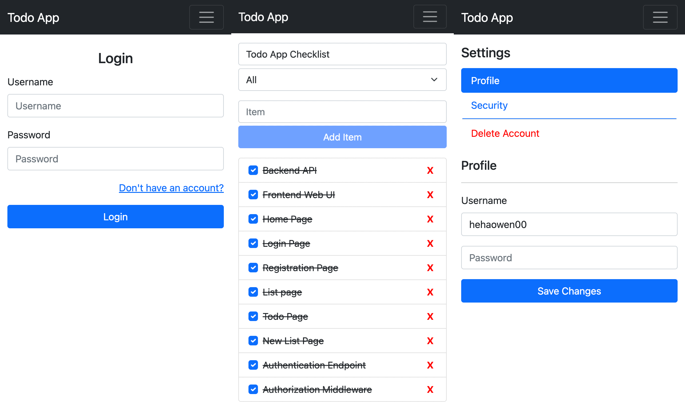

# todo-app

Todo list application



## Built With

- Bootstrap
- Docker
- Go
- MariaDB
- React.js

## Getting Started

1. Create .env file using the following template
```
DB_NAME=<db_name>
DB_USER=<db_username>
DB_PASSWORD=<db_password>

MARIADB_DATABASE=<db_name>
MARIADB_USER=<db_username>
MARIADB_PASSWORD=<db_password>
```

2. Create docker volume `db_data`

3. Add SSL certificate and key to /proxy/certs

4. Run docker-compose
```
docker-compose build
docker-compose up -d
```

## LICENSE

Distributed under [GPL v3](LICENSE)
